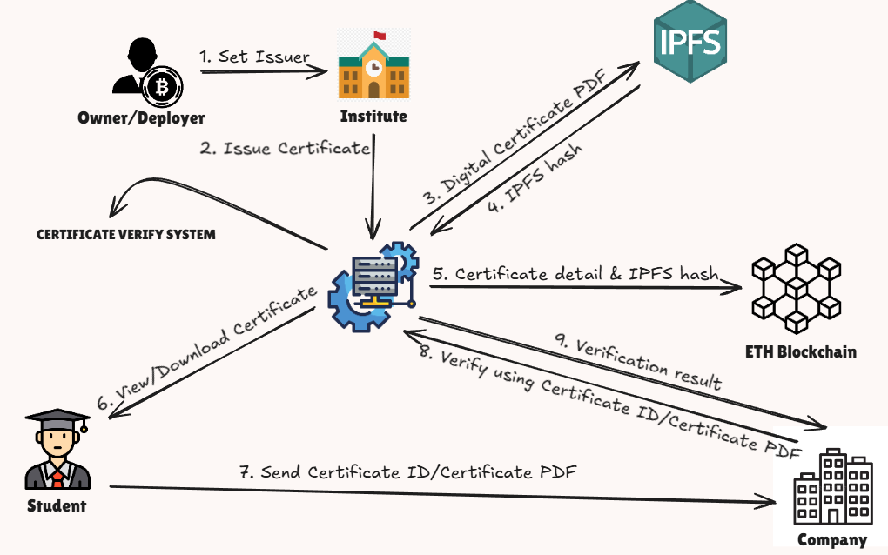
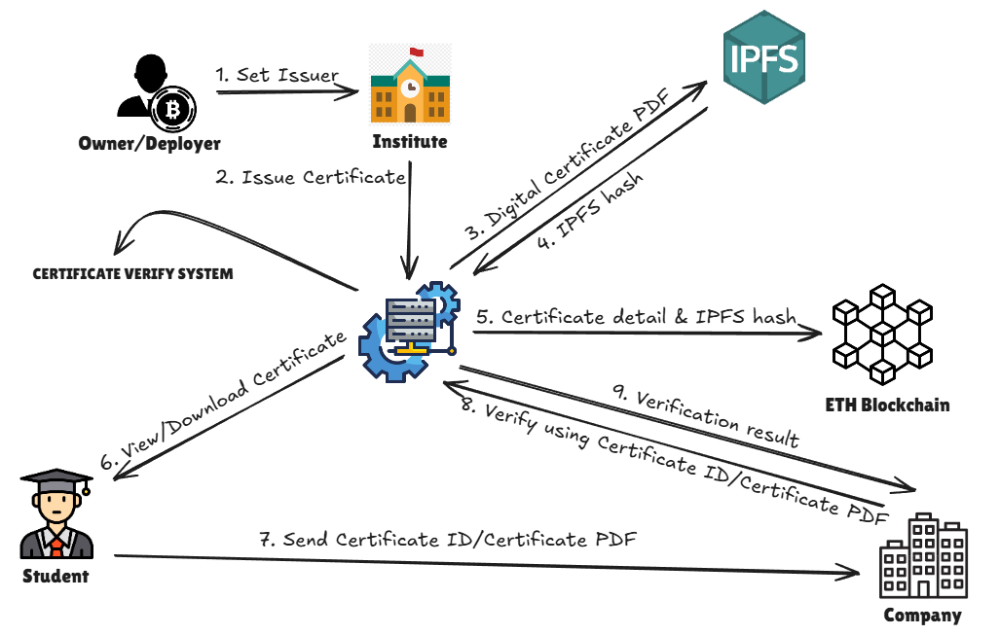
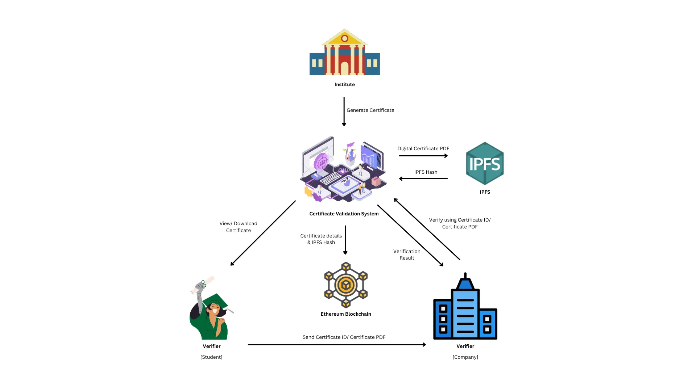

<div align="center">



</div>

# Cert-Verify DApp

Blockchain-based certificate issuance, verification, and revocation with on-chain roles (owner / issuer / user) and IPFS storage for certificate files.

## Highlights
- Issue certificates (PDF rendered, CID stored on-chain) with expiration support.
- Verify by certificate ID + uploaded PDF (IPFS hash comparison).
- Revoke certificates; show status colors on errors/reverts.
- Organization management: owner sets issuers, issuers manage their users.
- Frontend (Vite + React) with MetaMask network switching to Hardhat 31337.

## Architecture & Flow





## Tech Stack
- Smart contract: Solidity (Hardhat, OpenZeppelin Ownable)
- Frontend: React (Vite), ethers v5, pdf-lib, IPFS upload helper
- Wallet: MetaMask (network auto-switch to 31337)

## Smart Contract (CertificateContract)
- Roles: `owner` (admin) can set issuers; `issuer` can add/revoke users and issue certs; users hold certs.
- Key functions: `setIssuer`, `addUser`, `revokeUser`, `create` (issue), `revokeCertificate`, `verify`, `getCertificatesByUser`, `isAdmin`, `isOrgIssuer`.
- Revert reasons are surfaced in the UI (require messages parsed and color-coded).

## Project Structure (key parts)
- `chain/` – Hardhat project, contracts and deployment (`ignition/modules/deploy.js`).
- `client/` – Vite React app (UI, ABI, IPFS + contract helpers).
- `workflow.png`, `flow.png`, `image.png` – diagrams / preview used in this README.

## Prerequisites
- Node.js 18+ and npm
- MetaMask installed

## Setup & Run
```bash
# 1) Install deps
cd chain
npm install

cd ../client
npm install

# 2) Start local Hardhat chain (new terminal)
cd ../chain
npx hardhat node

# 3) Deploy contract to localhost (new terminal)
cd ../chain
npx hardhat ignition deploy ignition/modules/deploy.js --network localhost

# 4) Update frontend contract address if it changed
#   client/src/utils/Contract.js -> CONTRACT_ADDRESS

# 5) Run frontend (dev server)
cd ../client
npm run dev
```

## Using the DApp
1) Open the frontend, connect MetaMask; it will prompt to switch/add network 31337.
2) Roles:
	- Owner: set issuers; revoke issuer.
	- Issuer: add/remove users of their org; issue certificates (uploads PDF to IPFS, stores CID on-chain); revoke certs.
	- User: verify certificates by ID + uploaded PDF.
3) Certificate issuance: fill fields, generate/overwrite PDF, upload to IPFS, tx writes CID + hashes on-chain.
4) Verification: provide cert ID, upload the PDF; result shown with colored status.
5) Revocation: issuers can revoke; status shows revert reasons.

## Troubleshooting
- If MetaMask is on the wrong network, allow the prompted switch to 31337.
- If you redeploy, update `CONTRACT_ADDRESS` in `client/src/utils/Contract.js` and restart `npm run dev`.
- Hardhat node must be running before deploying and before using the UI.

